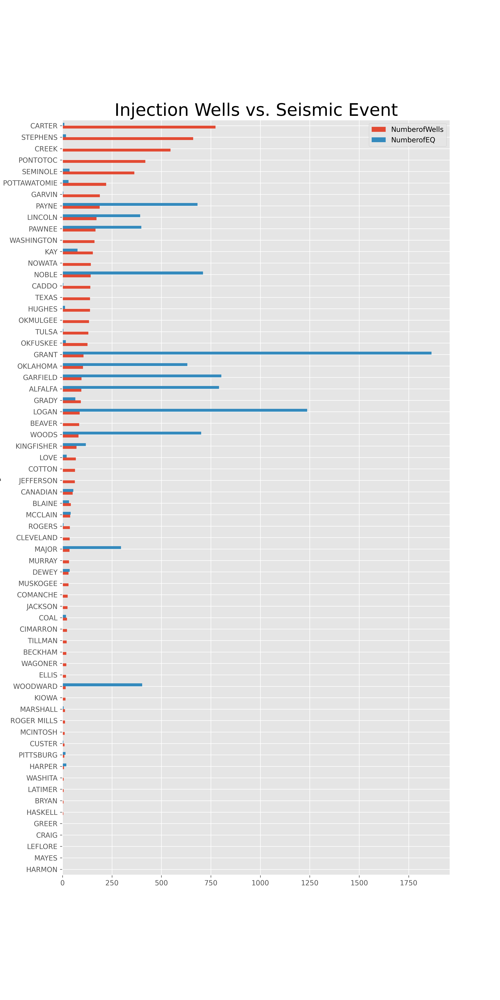
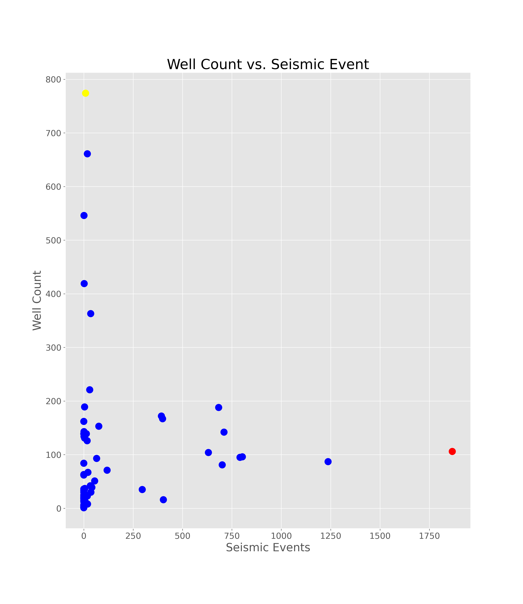
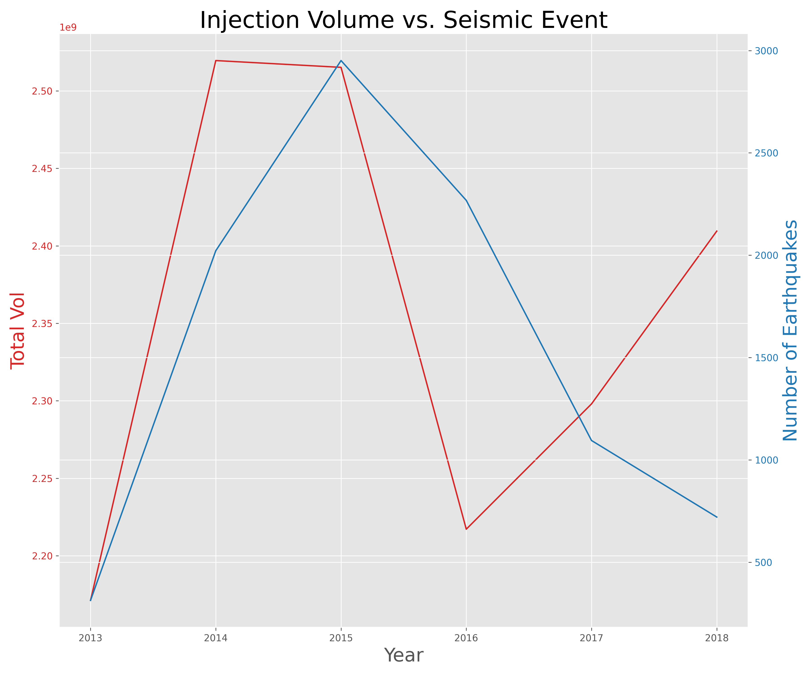
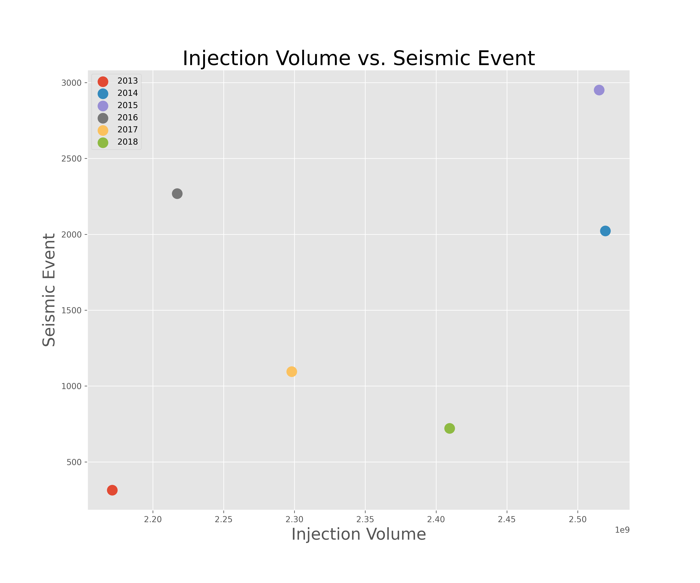
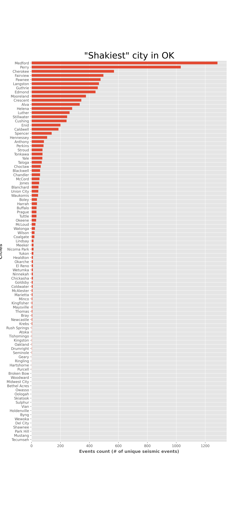
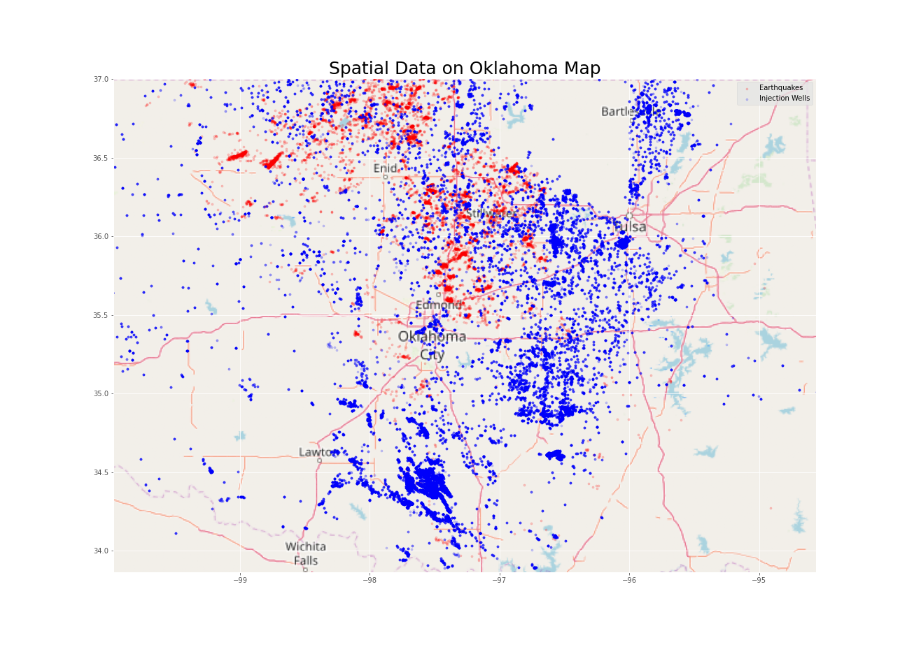
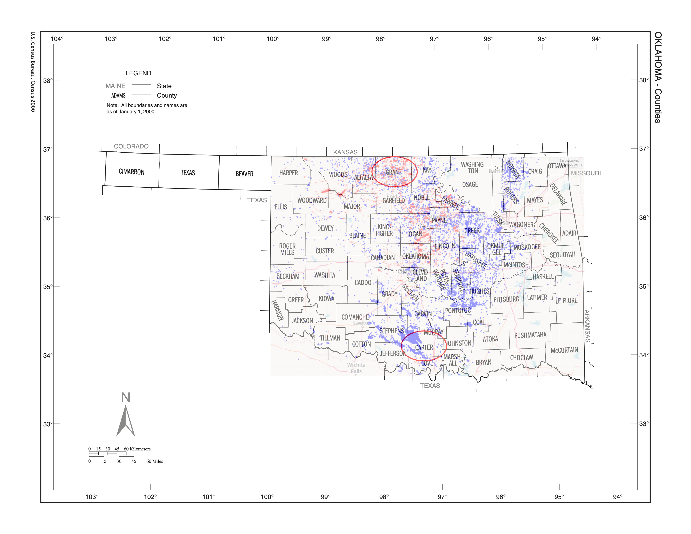

# Oklahoma Earthquakes

## Background

Oklahoma now has more earthquakes on a regular basis than California. Are they due to fracking?
In a few cases, yes, but in most cases no. Only a few of the over 2000 magnitude 3 and larger earthquakes since 2009 that have occurred in Oklahoma have been connected to hydraulic fracturing. 

The majority of earthquakes in Oklahoma are caused by the industrial practice​ known as "wastewater disposal". Wastewater disposal is a ​separate ​process in which fluid waste from oil and gas production is injected deep underground far below ground water or drinking water aquifers. In Oklahoma over 90% of the wastewater that is injected is a byproduct of oil extraction process and not waste frack fluid.

The purpose of this project is to prove that waste water disposal is the contributing factor to the earthquakes.

[Oklahoma Earthquakes](https://www.youtube.com/watch?v=AIu3b0WhMgs&feature=youtu.be)

## Hypothesis
* Seismic events in the state of Oklahoma can be shown as being the direct result of unrestricted waste water disposal across the state during the onset lateral oil and gas development

## Scope of Work
* Date range is from 2013 - 2018
* Earthquake recording of magnitude 2.5 or higher only

## Methods
* USGS api was used to acquire earthquake information
* OCC website was used as the source for UIC volumes by month, well, and yearly totals
* OU was used to acquire earthquake data to cross reference USGS dataset
* We used the reverse geocoding module to generate a city list to associate with the lat/longs from events
* Accessed Openstreet map and used geocode from USGS data to plot the wells and events on a map for a good visual 
* We used the glob method to import the excel files for merging

## Plots
* The number of wells and seismic activity per county

* Total volume per year shows the correlation to seismic activity

* City with the most seismic events

* The highest amount of earthquakes occured in Grant County, highest number of wells is in Carter County. The red indicates seismic activity, blue indicates disposal wells.

## Observations

*  There is a positive correlation between water waste disposal and seismic events on a statewide level

*  The correlation observed on a state level begins to break down on a county level

		1. The breakdown in the state wide correlation at the county level suggests 
		there are other controlling parameters such as underlying geologic complexity, 
		total volume per well, or the amount injected in a given period of time

		2. Since the Total Volume was observed to control the upward trending seismic 
		event count the well number doesn't appear to be a controlling factor, but rather 
		the total amount in a given well

		3. The 'total event per city' plot corroborates the 'events per county' plot and 
		compel our group to suggest investigation of other industry trends to see if there 
		are observed effects, i.e. real estate market trends in high event areas to determine 
		effect of seismicity on other valuation

*	Likely there is a relationship between depth of injection and seismic event frequency since certain formations are more frequently linked to deep basement faults. These fault systems are likely the ones that are critically stressed and result in the largest event magnitudes
      
*  Suggestions for future work include:

		1.  Investigating aforementioned effects on outside industry

		2.  Pump rates in seismically active areas

## Sources

* United States Geological Survey
* The University of Oklahoma Geological Survey
* Oklahoma Corporation Commission
* Openstreet map 

### Copyright

University of Texas, Data Analytics and Visualization Bootcamp, Team Frac © 2020
